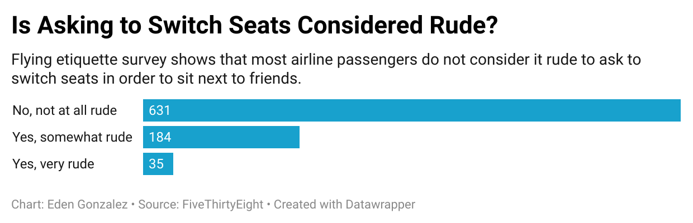

# datajournalism-week4

The Flying etiquette dataset was interesting as it gave surveyees small number of answer choices. Even so, it was able to capture the popular opinion that goes slighly further than **Yes** or **No** responses. This dataset is quite helpful in informing passengers on how to conduct themselves on a plane to try in create a positive flying expereince for most. 

From the dataset, I picked the question: <ins>Is it rude to ask someone to switch seats with you in order to be closer to friends?<ins>

I picked this particular dataset as this is a question I have previously asked a fellow passenger to switch seats and she agreed. She did not seem bothered by this interaction as she was able to sit *much* closer to the front of the plane. Though, I wanted to see if her seeiming unbothered with my request was *lucky* or if it was the popular sentiment. 

My chart, <ins>Is Asking to Switch Seats Considered Rude?<ins> 
shows that in general, most passengers do not find it rude to asks to switch seats in regards to friends. Though this does not reveal that these same people would also be willing to actually switch seats, it gives a decent understanding of the general sentiment regarding asking a fellow passenger to switch sheets. Though, exploring the dataset a bit further shows that asking to switch seats for family is generally considered less rude than for friends. 

